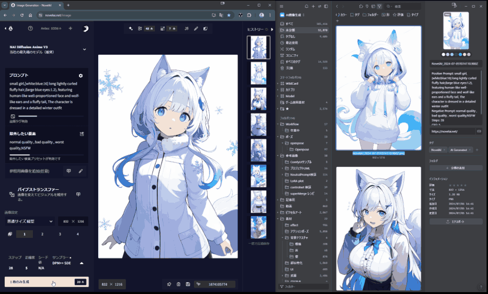
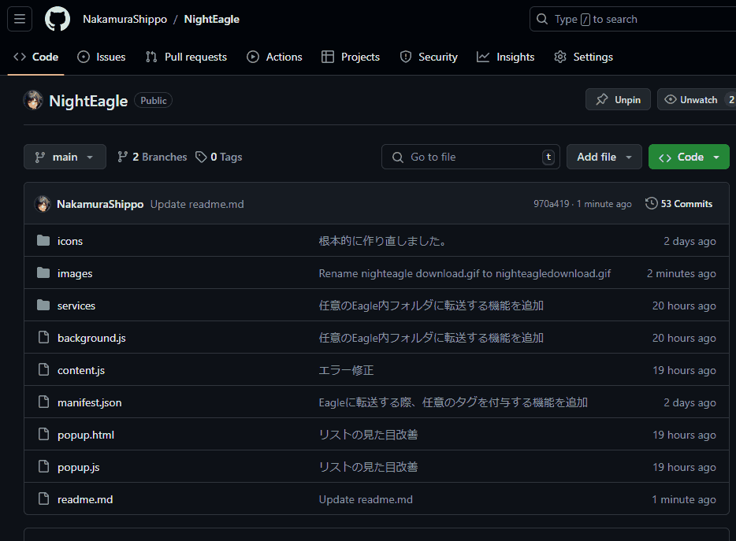

 # NightEagle -NovelAI to Eagle-

NightEagleは、NovelAIで生成された画像を自動的にEagleに転送するChrome拡張機能です。

## 更新履歴

- 2024/8/11: 管理しやすくするために作り替えました。
- 2024/7/8: 任意のEagle内フォルダに転送する機能を追加しました。
  - [da2el-ai](https://github.com/da2el-ai) さんから貴重なアイデアをいただきました。
- 2024/7/7: NightEagleのポップアップメニュー内に任意のタグを付与する機能を追加しました。
- 2024/7/7: 根本的に構造を見直して安定してEagleに転送できるように作り直しました。
- 2024/7/5: リリース、めっちゃ不安定なので作り直すつもり。

## 注意事項

- NovelAIとEagleの利用規約に同意する必要があります。
- 個人で使用する目的でのみ使用してください。
- たまに上手く動かない時がありますが、PCを再起動すると正常に動作すると思います。(稀にEagleとの接続が上手くいかない時があります)

## インストール方法

1. このリポジトリをクローンまたはダウンロードします。
   - 
   - ダウンロードした場合はzipファイルを解凍します。
3. Chromeブラウザを開き、`chrome://extensions` にアクセスします。
4. 右上の「デベロッパーモード」をオンにします。
5. 「パッケージ化されていない拡張機能を読み込む」をクリックします。
6. NightEagleのフォルダを選択します。
   - ダウンロードした場合は解凍したフォルダを選択します。

## 使用方法

- NAIのページを再読み込みしてから生成してください。
- インストールが出来ていれば、Eagleを起動した状態でNAIのページで生成すれば勝手に転送してくれます。
- 拡張機能のアイコンを表示させて、クリックするとポップアップメニューでEagleの転送先フォルダを任意に変更できます。

**注意** 
-ネガティブプロンプトの表示モードをタブ切り替えにしている場合は、ネガティブプロンプトを表示するようにしてください。

## トラブルシューティング
- Chromeのコンソールでエラーメッセージを確認し、問題がある場合は報告してください。
- たまに上手くいかない時がありますが、PCを再起動してもう一度試してみて下さい。
- ファイアーウォール等は切るか、eagleを除外するよう設定してみてください。

## プライバシーとセキュリティ
- この拡張機能は、NovelAIで生成された画像とそのメタデータのみを扱います。
- データはローカルのEagleアプリケーションにのみ転送され、第三者と共有されることはありません。
- 拡張機能のソースコードは公開されており、動作を確認することができます。

## 貢献
バグ報告や機能リクエストは、GitHubのIssuesを使用してください。プルリクエストも歓迎します。

## ライセンス
このプロジェクトは[MITライセンス](LICENSE)の下で公開されています。

## 免責事項

この拡張機能は、NovelAIおよびEagleと直接の関連はありません。使用に伴うリスクはユーザーが負うものとします。

## アップデート予定
- NAIのページがアプデした際に対処しやすくなるようにセレクターをjsonで管理
- ブラウザ版niji/mid向け(未定)
- ComfyUI版 (未定)
